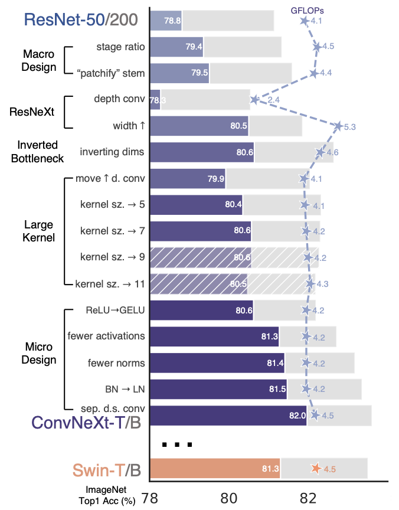

# ConvNext-MIMIC-Classification
This repo holds the implementation of ConvNext deep learning architecture trained on MIMIC Chest X-rays Dataset.

## Todo
- [x] Complete prerequisite certifications for MIMIC Access.
- [x] Download and process the dataset.
- [x] Design the ConvNext Architecture.
- [x] Build the dataflow pipeline.
- [x] 3% dataset trail run to ensure proper pipeline design as proof-of-work.
- [ ] Create an sbatch file to submit job to ASU's Sol supercomupter.
- [ ] Run on ASU's Sol supercomputer to obtain final results.
- [ ] Visualize Results.

## Chest X-ray Dataset: MIMIC

### Abstract
MIMIC Chest X-ray JPG (MIMIC-CXR-JPG) Database v2.0.0 is a large, freely accessible dataset that consists of JPG images of the chest together with structured labels taken from radiology reports that are written in free-text. This dataset, which was retrieved from the MIMIC-CXR database, includes 377,110 photos in JPG format along with structured labels that were obtained from 227,827 radiology reports. MIMIC-CXR-JPG is a standardized and user-friendly version of MIMIC-CXR that supports medical image interpretation, natural language processing, and decision support research. The dataset complies with the US Health Insurance Portability and Accountability Act of 1996 (HIPAA) Safe Harbor criteria by adhering to de-identification standards.

### Background
For thoracic assessment, chest radiography is a commonly used medical imaging modality that is essential for diagnosing cardiopulmonary disorders. Medical image interpretation has been delayed as a result of the declining number of radiologists, particularly in areas with limited resources. Automated radiograph analysis can increase radiologist productivity and reach underserved areas with knowledge. In order to stimulate research in automated chest radiograph analysis, the MIMIC-CXR-JPG database was established. To facilitate access for researchers who are not medical professionals, DICOM (Digital Imaging and Communications in Medicine) format images had to be converted to JPG. Because JPG has a smaller file size, it is often used in computer vision research even if it is lossy.

### Data Description

- Folder Structure: The images are arranged into ten folders, with JPG files and sub-folders for each patient, study, and individual.
- Metadata Files: mimic-cxr-2.0.0-metadata.csv.gz contains metadata information on the study kind, view position, image dimensions, and acquisition time.
- Data Splits: The data has been divided into three sets: "train", "validate", and "test." The appropriate DICOM identifiers for each set are provided in mimic-cxr-2.0.0-split.csv.gz.
- Structured Labels: Using the NegBio and CheXpert programs, labels for 13 different diseases (such as Atelectasis and Cardiomegaly) are generated and provided in the files mimic-cxr-2.0.0-chexpert.csv.gz and mimic-cxr-2.0.0-negbio.csv.gz. Labels designate whether information is present (1.0), absent (0.0), doubtful (-1.0), or missing.

Because of its uniform structure, this dataset makes a variety of research projects easier and contributes to improvements in medical picture processing and healthcare delivery. MIMIC-CXR-JPG can be used by researchers to create and assess automated systems, which will ultimately lead to better patient care and more effective diagnosis.

# Deep Learning Model: ConvNext
ConvNeXt is a state-of-the-art deep learning architecture intended to tackle a range of image identification task difficulties. We shall examine its main functions, architecture, training regimen, and testing strategy in this manual.

## Issues ConvNeXt Solutions

- **Inefficient Feature Extraction:** ConvNeXt effectively handles the problem of identifying objects at various scales within an image by capturing multi-scale features.
- **Parameter Utilization:** ConvNeXt optimizes parameter utilization, resulting in effective learning and minimal processing cost, by utilizing aggregated transformations and adaptive cardinality.
- **Versatility:** ConvNeXt's adaptive design helps it overcome issues related to applicability and versatility, allowing it to perform well in a variety of computer vision applications.

## Architecure of ConvNext
ConvNeXt's architecture is meticulously designed to address the challenges associated with recognizing objects of varying scales and complexities within images. Here are the key components of ConvNeXt:

### Multi-Scale Feature Aggregation
ConvNeXt employs a sophisticated technique for aggregating multi-scale features. It processes input images at multiple resolutions, allowing the model to capture fine-grained details as well as high-level context. This multi-scale approach enhances ConvNeXt's capability to recognize intricate patterns and objects of different sizes within a single image.

### Aggregated Transformative Units (ATUs)
ATUs serve as the fundamental building blocks of ConvNeXt's architecture. These units are responsible for dynamic feature transformations, enabling the model to learn complex patterns and representations from the input data. Within ATUs, ConvNeXt performs a series of adaptive transformations, allowing the network to focus on relevant features while discarding irrelevant information. This adaptability is crucial for handling diverse datasets with varying levels of complexity.

### Adaptive Cardinality
One of ConvNeXt's innovative features is its adaptive cardinality. Traditional convolutional networks rely on a fixed number of pathways within each layer, limiting their flexibility to adapt to different data complexities. ConvNeXt, however, dynamically adjusts the cardinality (the number of paths) within ATUs based on the input data. This adaptability ensures that the network can allocate resources effectively, dedicating more paths to complex features and fewer paths to simpler patterns. By doing so, ConvNeXt optimizes parameter usage, leading to improved accuracy and efficiency.

### Enhanced Connectivity Patterns
ConvNeXt incorporates enhanced connectivity patterns between ATUs to optimize information flow within the network. Strategic connections are established to capture both spatial and contextual information effectively. These connections enable the network to understand the relationships between features across different spatial locations, allowing ConvNeXt to recognize objects in their proper contexts. By leveraging these enhanced connectivity patterns, ConvNeXt excels at tasks that require a deep understanding of spatial relationships and object interactions within images.

## Training Process

To train ConvNeXt, follow these steps:

1. **Data Preparation:** Prepare your dataset, ensuring proper preprocessing and labeling.
2. **Architecture Configuration:** Define the ConvNeXt architecture, specifying the number of ATUs, adaptive cardinality, and other hyperparameters.
3. **Loss Function:** Choose an appropriate loss function based on your specific task (e.g., cross-entropy for classification).
4. **Optimizer:** Select an optimizer (e.g., Adam, SGD) and set its parameters.
5. **Training:** Train ConvNeXt on the prepared dataset using backpropagation and mini-batch gradient descent.

## Hyperparameter Tuning

To optimize ConvNeXt's performance, consider these hyperparameters:

- Learning Rate: Adjust the learning rate to control the step size during optimization.
- Batch Size: Determine the number of samples in each mini-batch for gradient updates.
- Number of ATUs: Experiment with different numbers of ATUs to find the optimal architecture complexity.
- Adaptive Cardinality: Tune the adaptive cardinality to balance model complexity and accuracy.
- Regularization: Apply techniques like dropout or L2 regularization to prevent overfitting.

## Testing Process

1. **Data Preparation:** Prepare the test dataset in the same manner as the training dataset.
2. **Model Loading:** Load the trained ConvNeXt model weights.
3. **Inference:** Perform inference on the test data using the loaded model.
4. **Evaluation:** Evaluate the model's performance using appropriate metrics (e.g., accuracy, precision, recall) based on the task.
5. **Result Analysis:** Analyze the results to gain insights into the model's strengths and areas for improvement.

# References
1. Johnson, Alistair, et al. "MIMIC-CXR-JPG - chest radiographs with structured labels" (version 2.0.0). PhysioNet (2019), https://doi.org/10.13026/8360-t248.
2. Johnson AE, Pollard TJ, Berkowitz S, Greenbaum NR, Lungren MP, Deng CY, Mark RG, Horng S. MIMIC-CXR: A large publicly available database of labeled chest radiographs. arXiv preprint arXiv:1901.07042. 2019 Jan 21.
3. Goldberger, A., Amaral, L., Glass, L., Hausdorff, J., Ivanov, P. C., Mark, R., ... & Stanley, H. E. (2000). PhysioBank, PhysioToolkit, and PhysioNet: Components of a new research resource for complex physiologic signals. Circulation [Online]. 101 (23), pp. e215–e220.
4. Facebook Research. (2022). ConvNeXt: Repository for ConvNeXt architecture. GitHub. https://github.com/facebookresearch/ConvNeXt
5. Liu, Z., Mao, H., Wu, C.-Y., Feichtenhofer, C., Darrell, T., & Xie, S. (2022). A ConvNet for the 2020s (No. 2201.03545). arXiv. Retrieved from https://arxiv.org/abs/2201.03545
6. Xie, Saining, et al. "Aggregated Residual Transformations for Deep Neural Networks." Proceedings of the IEEE Conference on Computer Vision and Pattern Recognition (CVPR). 2017.

*Dataset related related images taken from the official MIMIC CXR JPG documentation*
*ConvNext model related images taken from the official ConvNext CVPR 2022 Paper*
*Documentation generated with the **assistance** of ChatGPT*